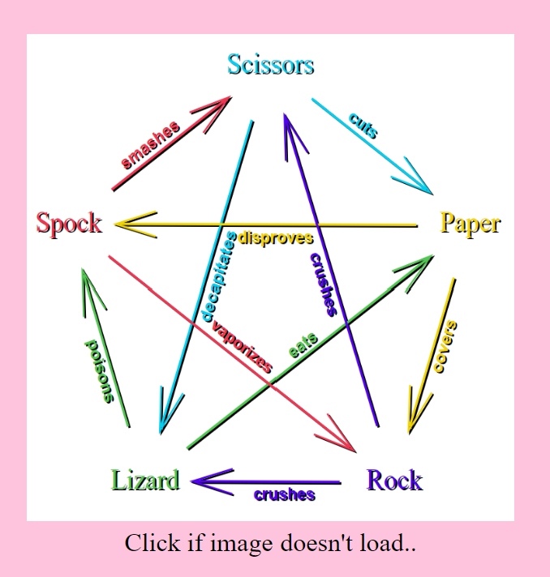
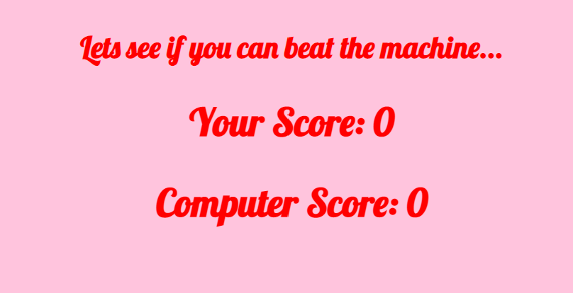

# Rock, Paper, Scissors, Lizard or Spock 
This website is for entertainment purposes. The user will have a chance to play a game widely known after its appereance in the tv series Big Bang Theory. Everyone already knows how to play Rock, Paper , Scissors, but due to the demand of increasing complexity of this game, Rock, Paper, Scissors, Lizard or Spock was introduced. The game will be explained on this website and there will be the option for the user to play against the computer. 

This website is build to fit all devices. 

[This is the deployed site](https://tabithadejong.github.io/RockPaperScissors/index.html)

## Features 
### Existing Features
- Home Page 
  - Introduction the Game 
    - Here the user can read a little intro on the game and from what other game it is based of. 
    
  - Picture of Rules 
    - This is a visual explaination on how to play the game. The user can read here who wins over who, with what hand guesture. 
    
  - Links to the Game 
    - On the home page there are three clickable links that will lead the user to the game room. 
    1. 
    2. 
    3. 
- Game Room
  - Score board 
    - This section will keep score between the computer and user. It is important that there is an end to the game so the user will be stimulated to a goal. 
    
  - The Game 
    - This is the section where the game is played. With buttons the user is able to pick a choice against the automatically generated choice of the computer 
    
  - The pop-up 
    - The alert message will display if one of the 2 competitors has reached a score of 5. It will tell the user what the winning or losing strike was. After clicking on the alert message the page will reload and the game will reset to starting values again. 
    
  - Link Back 
    - Whenever the user wants to leave the game room this link can be clicked. It will take the user back to the home page. Here the user can read the instructions again. 
    
### Features Left to Implement 
- More Games 
  - In the future it would be great to elaborate this entertainment website. For example there could be added many more games and the option for the user to switch between these games. 
  - The option to play with multiple contesters would also be a desired future feature. 
## Testing 
### Validator Testing
- [x] CSS - [Jigsaw Validator](https://jigsaw.w3.org/css-validator/)
  - The code passed with no problems 
  
- [x] HTML -  [Validator W3C](https://validator.w3.org/)
  - The code passed with 1 warning; <section> Does not have a <h> element. Use 
 instead.
    - As I have used div's in all section I did not alter the code after this warning. 
   
- [x] Javascript - [Jshint](https://jshint.com/)
  - The JS code passed with the following metrics; 
  1. There are 8 functions in this file.
  2. Function with the largest signature take 1 arguments, while the median is 0.
  3. Largest function has 23 statements in it, while the median is 5.
  4. The most complex function has a cyclomatic complexity value of 42 while the median is 2.
  
- [x] Lighthous - Lighthouse browser extension
  - The website passed all testing criteria above average. 
  
- [x] Peer review 
  - When played by friends the game did function as expected. 

## Bugs 
### Fixed Bugs 
- In one of the earlier versions of the game, the computer did not calculate the winner correctly. This was due to some spelling error which have been filtered out afterwards. 
- When the one of the competitors would have a score of 5 the earlier version of the game would show an alert informing a win or loss but not the last move was not displayed before would have reset itself to starting values. This was fixed through adding templates literals in the alert message. 

### Unfixed Bugs 
- No bugs have been left unfixed. 

## Deployment 
- This website was deployed through Github pages. The following steps were taken: 
  - Browse to settings in the specific repository. 
  - From the source section drop-down menu, select the Main branche, and then create page.
  - The link to the page is created then on the account and accesible from all devices 
  - This it the link : https://tabithadejong.github.io/RockPaperScissors/index.html

## Credits 
### Content 
- The rules of the game I have found online through google searches. 
### Media 
- The picture on the home page is found through a search for stock free images on google. 
### Code 
- [Code Institute](https://learn.codeinstitute.net/dashboard)
  - Here I learned most of my knowledge on how to use HTML, CSS and JS. 
  - The walkthrough project [Love Math](https://code-institute-org.github.io/love-maths/) has helped me understand the fundamentals on how to build a game/project with JS. 
- Youtube tutorials inspired me how to build the game. [Link to youtube search](https://www.youtube.com/results?search_query=rock+paper+scissors+javascript)
### General Direction 
- Code Institute has helped form the idea for this game 
- Throughout the project I have had a couple meetings with a mentor who has given me feedback. 

## Other General Information 

